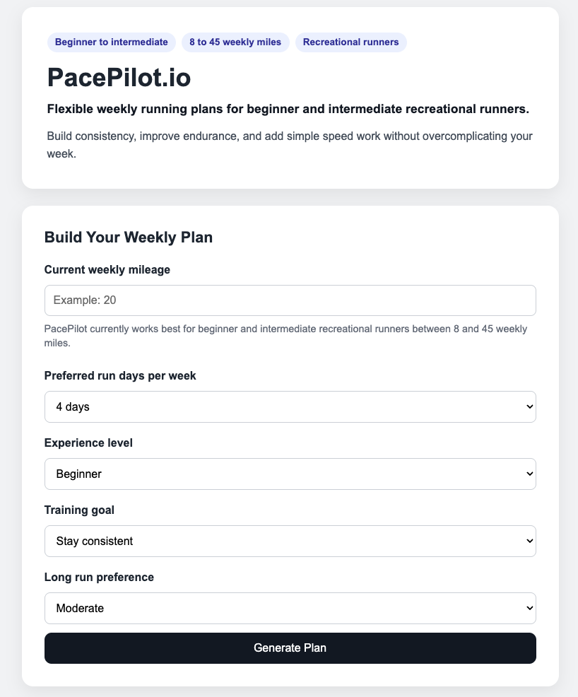
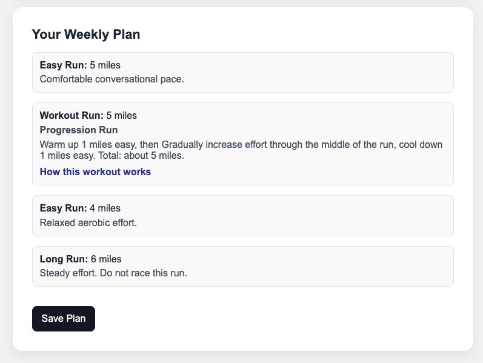
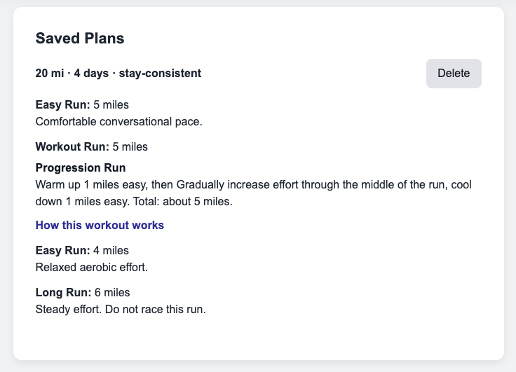

# PacePilot.io

PacePilot.io is a beginner friendly running plan generator built with React.

I made this project for beginner and intermediate recreational runners who want a simple weekly structure to help them build consistency, improve endurance, and add light speed work without overcomplicating their training.

After running cross country and track in college, I know how valuable structure can be. But I also know that most people do not need an elite training plan. They need something approachable that helps them rebuild consistency and confidence so I built PacePilot around that idea. I have taken plenty of breaks from running myself, so I used the kind of structure I would follow to rebuild fitness and translated that thinking into app logic.

PacePilot is best designed for runners training between 8 and 45 miles per week. It is meant to give users a realistic starting point for rebuilding endurance and routine.

## Visit deployed app below!

[https://pacepilot-io.onrender.com/]  

Walkthrough video: [https://youtu.be/Yma74Jno97U]


## Tech Stack

- React
- JavaScript
- Vite
- CSS
- localStorage


## Features

- Generate a flexible weekly running plan based on:
  - current weekly mileage
  - preferred run days per week
  - experience level
  - training goal
  - long run preference
- Use rule based logic to create a more realistic mileage distribution
- Add workout guidance through a small workout library
- Explain workouts in plain language with expandable descriptions
- Save plans locally in the browser with localStorage
- Prevent duplicate saved plans
- Provide guardrails for unsupported mileage ranges


## What I Learned

This project helped me get more comfortable with core React concepts like:

- `useState` for form input, generated plans, saved plans, and UI feedback
- `useEffect` for persisting saved plans with localStorage
- conditional rendering for messages, workout explanations, and generated output
- mapping over arrays to render plans and saved runs
- organizing logic with helper functions and reusable data structures

It also pushed me to think more like a product builder. I had to decide who the app was for and what training range it should support. I wanted to keep the output simple but still useful without pretending it could handle every type of runner. Because of that, I narrowed the scope to runners with weekly mileage between 8 and 45 miles per week.


## Screenshots
**Home**


**Generated Plan**


**Saved Plan**



## Future Improvements

- Add additional workouts to the workout library
- Continue improving the UI


## Running Locally

1. **Clone the repository**
   ```bash
    # Download or clone this repository:
   git clone `https://github.com/akonisanchez/pacepilot-io.git`
   ```
   
2. **Open terminal and move into project folder:**
   ```bash
    # Change directory to where it is saved
   cd pacepilot-io
   ```
3. **Install project requirements**
  ```bash
  npm install
  ```

4. **Start the app**
    ```bash
     npm run dev
    ```
